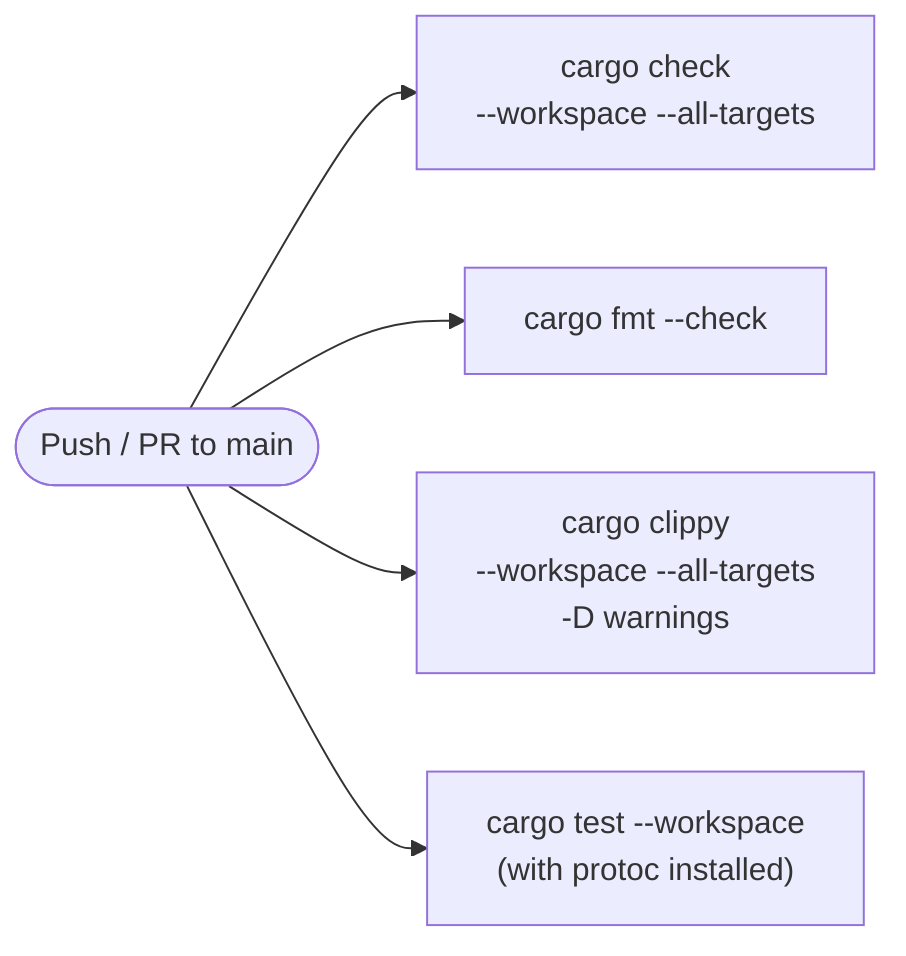
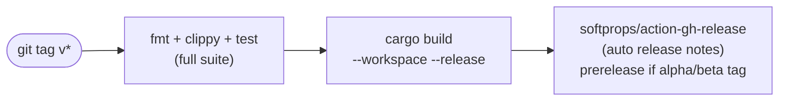

# Deployment & Infrastructure

> Related: [overview.md](overview.md) · [security.md](security.md)

---

## 1. Local Development

### Prerequisites

| Dependency | Version | Purpose |
|---|---|---|
| Rust toolchain | `stable` (via `rustup`) | All 13 crates |
| `protobuf-compiler` (`protoc`) | ≥ 3.x | gRPC code generation in `nstn-common` build script |
| Node.js + `npx` | ≥ 18 | ruflo MCP bridge (vendor/ruflo) — optional for pure Rust dev |
| Qdrant | Latest | RuVector semantic store — optional, falls back to in-memory |

Install `protoc` on Ubuntu/Debian:

```bash
sudo apt-get update && sudo apt-get install -y protobuf-compiler
```

Install `protoc` on macOS:

```bash
brew install protobuf
```

### Build

```bash
# Clone with submodules (vendor/ruflo)
git clone --recurse-submodules <repo-url>
cd nanosistant

# Check all crates compile
cargo check --workspace --all-targets

# Run all tests
cargo test --workspace

# Build release binaries
cargo build --workspace --release
```

The main binaries produced:

| Binary | Crate | Purpose |
|---|---|---|
| `nanosistant` | `nstn-cli` | Terminal REPL client |
| `nstn-server` | `nstn-server` | Axum HTTP server (REST + SSE) |

### Running the CLI

```bash
# Requires ANTHROPIC_API_KEY (or another provider key) in environment
ANTHROPIC_API_KEY=sk-ant-... cargo run --bin nanosistant
```

### Running Tests

```bash
# All crates
cargo test --workspace

# Specific crate
cargo test -p nstn-common

# Specific module
cargo test -p nstn-common -- router
cargo test -p nstn-ruflo -- memory
cargo test -p nstn-ruflo -- dreamer

# With output
cargo test --workspace -- --nocapture
```

---

## 2. Docker

Nanosistant itself does not ship a top-level `Dockerfile` — each deployment uses the binaries built by Cargo. The `vendor/ruflo/ruflo/docker-compose.yml` covers the ruflo submodule's services (chat UI, MCP bridge, nginx, ruvocal).

For containerized Nanosistant deployment, the recommended approach is a multi-stage Rust build:

```dockerfile
# Example Dockerfile (not committed — adapt to your environment)
FROM rust:1.82-slim AS builder
RUN apt-get update && apt-get install -y protobuf-compiler
WORKDIR /app
COPY . .
RUN cargo build --release --bin nanosistant --bin nstn-server

FROM debian:bookworm-slim
RUN apt-get update && apt-get install -y ca-certificates && rm -rf /var/lib/apt/lists/*
COPY --from=builder /app/target/release/nanosistant /usr/local/bin/
COPY --from=builder /app/target/release/nstn-server /usr/local/bin/
COPY config/ /app/config/
WORKDIR /app
CMD ["nstn-server"]
```

### Sandbox in Containers

The `SandboxStatus` system (`crates/runtime/src/sandbox.rs`) auto-detects container environments by checking:
- `/.dockerenv` file presence
- `/run/.containerenv` file presence
- `CONTAINER`, `DOCKER`, `PODMAN`, `KUBERNETES_SERVICE_HOST` env vars
- `/proc/1/cgroup` for `docker`, `containerd`, `kubepods`, `podman`, `libpod` strings

When running inside a container, `namespace_restrictions` may be unavailable (requires `unshare`). The sandbox falls back gracefully with a logged `fallback_reason`.

---

## 3. Environment Variables

### Core System

| Variable | Required | Description |
|---|---|---|
| `NSTN_CONFIG_HOME` | No | Override config directory (default: `config/`) |
| `NSTN_REMOTE` | No | Set to `"1"` or `"true"` for remote session mode |
| `NSTN_REMOTE_SESSION_ID` | No | Session ID for remote mode |
| `NSTN_SESSION_TOKEN_PATH` | No | Path to persisted session token |
| `NSTN_CA_BUNDLE_PATH` | No | Custom CA bundle for TLS verification |
| `NSTN_SYSTEM_CA_BUNDLE` | No | System CA bundle path override |
| `NSTN_UPSTREAM_PROXY_ENABLED` | No | Enable upstream proxy (`"true"`) |

### Sandbox

| Variable | Set By | Description |
|---|---|---|
| `NSTN_SANDBOX_FILESYSTEM_MODE` | System | Active filesystem isolation mode (`off`, `workspace-only`, `allow-list`) |
| `NSTN_SANDBOX_ALLOWED_MOUNTS` | System | Colon-separated allowed mount paths |

### Plugin System

| Variable | Set By | Description |
|---|---|---|
| `NSTN_PLUGIN_ROOT` | System | Plugin root directory |
| `NSTN_PLUGIN_ID` | System (per plugin) | Plugin identifier |
| `NSTN_PLUGIN_NAME` | System (per plugin) | Plugin display name |
| `NSTN_TOOL_NAME` | System (per tool call) | Tool being invoked |
| `NSTN_TOOL_INPUT` | System (per tool call) | Tool input JSON |

### Web Search

| Variable | Required | Description |
|---|---|---|
| `NSTN_WEB_SEARCH_BASE_URL` | No | Custom base URL for web search tool |

---

## 4. Model Providers

Nanosistant supports multiple model providers via the `nstn-api` crate (`crates/api/src/providers/`). The provider is selected automatically from the model name and available API keys.

### Anthropic (default)

| Variable | Required | Description |
|---|---|---|
| `ANTHROPIC_API_KEY` | Yes | API key (also accepted as `ANTHROPIC_AUTH_TOKEN`) |
| `ANTHROPIC_BASE_URL` | No | Override base URL (default: Nanosistant gateway) |

**Default models** (from `config/settings.toml`):

| Role | Model |
|---|---|
| Primary | `claude-sonnet-4-20250514` |
| Reasoning | `claude-opus-4-6` |
| Fast | `claude-haiku-4-0` |

**Model aliases** (resolved in `crates/api/src/providers/mod.rs`):

| Alias | Resolves to |
|---|---|
| `opus` | `claude-opus-4-6` |
| `sonnet` | `claude-sonnet-4-6` |
| `haiku` | `claude-haiku-4-5-20251213` |

### Azure OpenAI

| Variable | Required | Description |
|---|---|---|
| `AZURE_OPENAI_API_KEY` | Yes | Azure API key |
| `AZURE_OPENAI_BASE_URL` | Yes | `https://{resource}.openai.azure.com` |

Authentication uses the `api-key` header (not `Authorization: Bearer`). URL format: `{base_url}/openai/deployments/{model}/chat/completions?api-version=2025-04-01-preview`.

Detected when model name starts with `gpt-`, `o1`, `o3`, `o4`, contains `davinci` or `turbo`.

### OpenAI

| Variable | Required | Description |
|---|---|---|
| `OPENAI_API_KEY` | Yes | OpenAI API key |
| `OPENAI_BASE_URL` | No | Override base URL (default: `https://api.openai.com/v1`) |

Authentication uses `Authorization: Bearer <key>`.

### xAI (Grok)

| Variable | Required | Description |
|---|---|---|
| `XAI_API_KEY` | Yes | xAI API key |
| `XAI_BASE_URL` | No | Override base URL (default: `https://api.x.ai/v1`) |

**Model aliases**:

| Alias | Resolves to |
|---|---|
| `grok`, `grok-3` | `grok-3` |
| `grok-mini`, `grok-3-mini` | `grok-3-mini` |
| `grok-2` | `grok-2` |

### Ollama (local inference)

Ollama is supported via the OpenAI-compatible endpoint. Set:

```bash
OPENAI_BASE_URL=http://localhost:11434/v1
OPENAI_API_KEY=ollama  # any non-empty value
```

Then use any model name matching what you have pulled in Ollama (e.g. `llama3`, `mistral`).

### Provider Selection Logic

The provider is resolved in this priority order (in `detect_provider_kind()`):

1. Model name is in the registry → use registered provider
2. Model looks like Azure (`gpt-*`, `o1*`, `o3*`, `o4*`) AND `AZURE_OPENAI_API_KEY` is set → Azure
3. Same model AND `OPENAI_API_KEY` is set → OpenAI
4. `ANTHROPIC_API_KEY` available → Anthropic (NstnApi)
5. `OPENAI_API_KEY` available → OpenAI
6. `XAI_API_KEY` available → xAI
7. `AZURE_OPENAI_API_KEY` available → Azure
8. Default to NstnApi

---

## 5. CI/CD — GitHub Actions

### CI Pipeline (`.github/workflows/ci.yml`)

Triggers on every push and pull request to `main`.



All four jobs run in parallel on `ubuntu-latest`. `Swatinem/rust-cache@v2` caches Cargo build artifacts between runs. `RUSTFLAGS: -Dwarnings` ensures warnings are treated as errors.

### Release Pipeline (`.github/workflows/release.yml`)

Triggers on tags matching `v*`.



The release job requires `contents: write` permission to create the GitHub Release. Releases tagged with `alpha` or `beta` in the tag name are automatically marked as pre-releases.

### Submodule Checkout

Both workflows use `submodules: recursive` in `actions/checkout@v4` to ensure `vendor/ruflo/` is populated. The proto build script (`crates/common/build.rs`) requires the compiled proto files to be accessible during `cargo build`.
