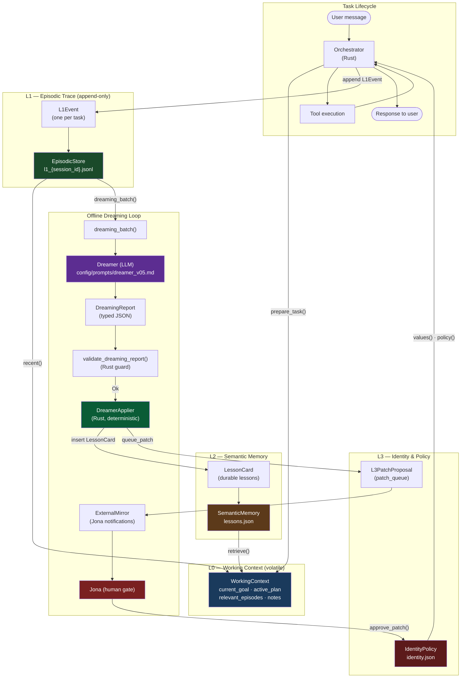

# Memory Tier System (L0–L3)

> Related: [overview.md](overview.md) · [typed-ir.md](typed-ir.md) · [security.md](security.md)

Nanosistant's memory system is organized into four tiers of increasing durability and decreasing write frequency. The design principle is identical to the Typed-IR discipline: LLMs never write to memory directly — they produce typed proposals that deterministic Rust code validates and applies.

---

## 1. Tier Definitions

| Tier | Name | Scope | Timescale | Storage | Who Can Write |
|---|---|---|---|---|---|
| **L0** | Working Context | Current task only | Volatile (in-memory) | `WorkingContext` struct | Orchestrator (Rust) |
| **L1** | Episodic Trace | Session → all-time | Append-only, persistent | JSONL per session (`episodes/l1_{session_id}.jsonl`) | `EpisodicStore::append()` — Orchestrator |
| **L2** | Semantic Memory | Cross-session, durable | Persistent, updatable | `lessons.json` | `DreamerApplier` (Rust, from `DreamingReport`) |
| **L3** | Identity & Policy | Permanent, versioned | Rarely changes | `identity.json` | Jona (human) only, after patch approval |

The `MemorySystem` struct unifies all four tiers under a single interface rooted at a `data_dir`:

```
{data_dir}/
  episodes/         ← L1 JSONL files per session
    l1_{session_id}.jsonl
  lessons.json      ← L2 lesson cards
  identity.json     ← L3 identity/policy
```

---

## 2. L0 — Working Context

**Struct:** `WorkingContext` (`crates/ruflo/src/memory.rs`)  
**Lifetime:** Built at the start of each task via `MemorySystem::prepare_task()`, cleared on task end or fatal failure.

```rust
pub struct WorkingContext {
    pub current_goal: String,
    pub active_plan: Option<ExecutionPlan>,
    pub relevant_episodes: Vec<L1Event>,   // injected from L1
    pub relevant_lessons: Vec<LessonCard>, // injected from L2
    pub notes: Vec<String>,
}
```

`prepare_task(goal, task_type)` performs two retrieval steps automatically:
- **L1 inject:** fetches the 5 most recent `L1Event`s matching `task_type` from `EpisodicStore::recent(20)`
- **L2 inject:** fetches the top 3 `LessonCard`s from `SemanticMemory::retrieve(task_type, goal, 3)` by keyword + confidence score

L0 is **never persisted**. It is purely the live scratchpad for the current task. The God-Time check in `crates/ruflo/src/god_time.rs` reads L0's `current_goal` and `notes` to detect drift before any non-trivial action.

---

## 3. L1 — Episodic Trace

**Struct:** `L1Event` / `EpisodicStore` (`crates/ruflo/src/memory.rs`)  
**Invariant:** Append-only. Events are never rewritten or deleted.  
**Storage:** One JSONL file per session — `episodes/l1_{session_id}.jsonl`.

### L1Event Schema

```rust
pub struct L1Event {
    pub episode_id: String,          // UUID v4
    pub timestamp: DateTime<Utc>,
    pub session_id: String,
    pub agent: String,               // agent name: "music", "investment", etc.
    pub task_type: TaskType,         // FileOp | CodeEdit | WebSearch | ...
    pub intent: String,              // user intent summary
    pub plan_stated: Option<String>, // plan at task start
    pub steps_taken: Vec<String>,    // ordered action log
    pub tools_called: Vec<ToolCallRecord>,
    pub outcome: Outcome,            // Success | Partial | Failure | Aborted | UnsafeBlocked
    pub user_feedback: Option<String>,
    pub watchdog_fired: bool,
    pub watchdog_reason: Option<String>,
    pub memory_tiers_used: Vec<String>,
    pub error_messages: Vec<String>,
    pub loop_count: u32,
    pub token_budget_at_close: f64,  // 0.0–1.0 fraction remaining
    pub notes: String,
}
```

### TaskType Enum

```rust
pub enum TaskType {
    FileOp, CodeEdit, WebSearch, MemoryQuery,
    Orchestration, ComputerControl, MultiAgent, Unknown,
}
```

### Outcome Enum

```rust
pub enum Outcome {
    Success, Partial, Failure, Aborted, UnsafeBlocked,
}
```

### Key `EpisodicStore` Methods

| Method | Description |
|---|---|
| `append(event)` | Appends to in-memory vec; returns `episode_id` |
| `session_events(session_id)` | All events for a session |
| `recent(n)` | `n` most recent events (newest first) |
| `by_outcome(outcome)` | Filter by outcome type |
| `dreaming_batch(max)` | Returns failure/watchdog events for Dreamer |
| `save()` | Flush to JSONL files on disk |
| `load_all()` | Load all JSONL files from disk |

The `dreaming_batch()` selector picks events matching `Failure | Partial | Aborted | UnsafeBlocked` or `watchdog_fired == true`, sorted newest-first, capped at `max`.

---

## 4. L2 — Semantic Memory

**Struct:** `LessonCard` / `SemanticMemory` (`crates/ruflo/src/memory.rs`)  
**Written by:** `DreamerApplier::apply()` — deterministic Rust, never by LLMs directly.  
**Storage:** `lessons.json` (pretty-printed JSON array).

### LessonCard Schema

```rust
pub struct LessonCard {
    pub id: String,                          // UUID v4
    pub task_types: Vec<TaskType>,
    pub primary_class: String,               // MAST failure class: "FC1.1", "FC2.3", etc.
    pub galileo_pattern: Option<String>,     // "G1", "G2" — repeating anti-patterns
    pub confidence: f64,                     // 0.0–1.0
    pub supporting_episodes: Vec<String>,    // episode_ids from L1
    pub contradicts_prior: Option<String>,   // id of contradicted card
    pub supersedes_prior: Option<String>,    // id of deprecated card
    pub situation: String,                   // when this lesson applies
    pub what_happened: String,               // what went wrong or what worked
    pub instruction: LessonInstruction,
    pub verifiable_signal: String,           // observable test for the lesson
    pub created_at: DateTime<Utc>,
    pub deprecated: bool,
    pub usage_count: u32,
    pub last_used: Option<DateTime<Utc>>,
}

pub struct LessonInstruction {
    pub trigger_condition: String,
    pub required_action: String,
    pub check_before: Option<String>,
    pub check_after: Option<String>,
}
```

### Retrieval

`SemanticMemory::retrieve(task_type, query, max_results)` scores each active (non-deprecated) lesson by:

```
combined = confidence × 0.6 + keyword_overlap × 0.4
```

`keyword_overlap` is the fraction of query words found in `situation + what_happened + trigger_condition`. Results are sorted descending by `combined` score.

### Deprecation

When a new `LessonCard` has `supersedes_prior = Some(prior_id)`, `SemanticMemory::insert()` automatically marks the prior card as `deprecated = true`. Deprecated cards remain in storage for auditability but are excluded from retrieval.

---

## 5. L3 — Identity & Policy

**Struct:** `IdentityPolicy` (`crates/ruflo/src/memory.rs`)  
**Written by:** Jona (human principal) only, via `approve_patch()`.  
**Storage:** `identity.json` (versioned).

### Fields

```rust
pub struct IdentityPolicy {
    pub core_values: Vec<String>,            // ["honesty", "helpfulness", "safety", "autonomy_with_oversight"]
    pub tool_policies: HashMap<String, String>, // tool name → policy rule
    pub filesystem_mode: String,             // "read_write" | "read_only"
    pub patch_queue: Vec<L3PatchProposal>,   // pending Jona review
    version: u32,                            // monotonically incremented
}
```

### L3PatchProposal Schema

```rust
pub struct L3PatchProposal {
    pub id: String,
    pub target_config_key: String,       // e.g. "agent.loop_limit"
    pub risk_level: RiskLevel,           // Low | Medium | High
    pub supporting_episodes: Vec<String>,
    pub supporting_lessons: Vec<String>,
    pub current_behavior: String,
    pub proposed_change: ProposedChange, // { before, after }
    pub test_to_pass: String,
    pub rollback_condition: String,
    pub human_review_required: bool,     // always true — enforced by constructor
    pub status: PatchStatus,             // Pending | Approved | Rejected | Applied
}
```

`human_review_required` is hardcoded to `true` in `L3PatchProposal::new()`. No code path allows auto-applying L3 patches. All L3 changes are surfaced to the `ExternalMirror` notification queue for Jona's attention.

---

## 6. Dreaming — L1 → L2 via the Dreamer

The Dreamer is an offline batch analysis LLM call (prompt at `config/prompts/dreamer_v05.md`) that runs against a batch of L1 traces. It is the primary mechanism for converting raw experience into durable lessons.

### Dreamer Input

```rust
pub struct DreamerInput {
    pub batch_window: String,       // date range
    pub total_episodes: usize,
    pub session_count: usize,
    pub system_mode: SystemMode,    // ReadOnly | Active
    pub soul_md_hash: String,       // integrity check
    pub prior_lesson_ids: Vec<String>,
    pub episodes: Vec<L1Event>,
}
```

### DreamingReport (primary output)

```rust
pub struct DreamingReport {
    pub dream_id: String,
    pub system_mode: SystemMode,
    pub soul_md_hash_verified: bool,
    pub soul_md_changed: bool,
    pub partition: Partition,              // { clean_success, qualified_success, failure_partial, unsafe_blocked }
    pub health_signal: HealthSignal,       // Healthy | Degraded | Critical
    pub failure_classifications: Vec<FailureClassification>,
    pub lesson_cards: Vec<DreamerLessonCard>, // max 5 per report
    pub l3_patch_proposals: Vec<L3PatchProposal>,
    pub routing_weight_hints: Vec<RoutingWeightHint>,
    pub orchestrator_dispatch: Vec<OrchestratorTask>,
    ...
}
```

### DreamerApplier (deterministic application)

`DreamerApplier::apply(report, memory)` maps typed fields from the `DreamingReport` directly onto the memory tiers:

1. For each `DreamerLessonCard`: calls `LessonCard::from_dreamer(dlc)` → `memory.l2.insert(lesson)`
2. If `system_mode == Active`: for each `L3PatchProposal`: `memory.l3.queue_patch(patch)` → surfaces to `ExternalMirror`
3. Records `routing_weight_hints` count (passed to Orchestrator separately)
4. Records `orchestrator_dispatch` count (Orchestrator handles these)

`DreamerApplier` **never calls an LLM**. It is a pure mapping function.

---

## 7. Data Flow Diagram


