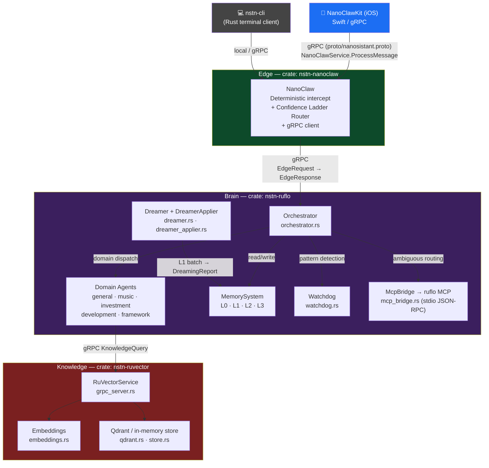
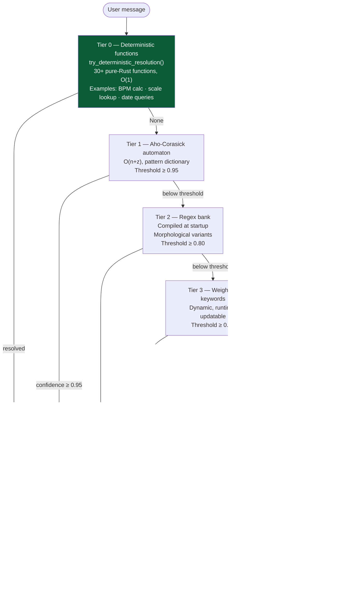
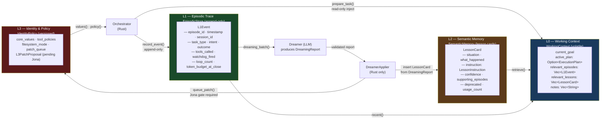
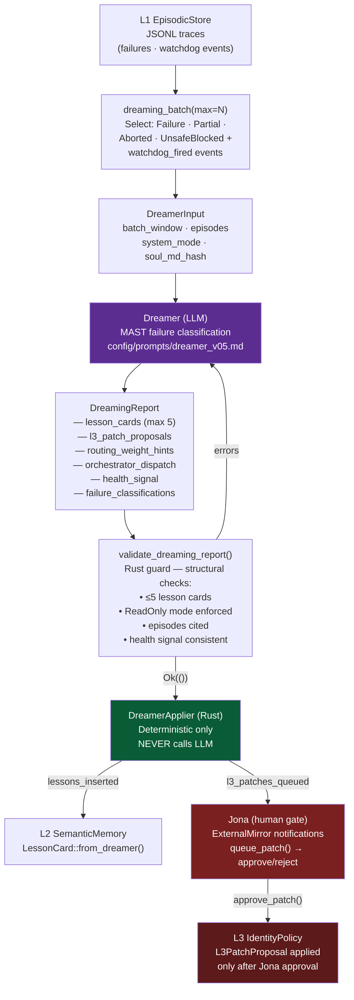
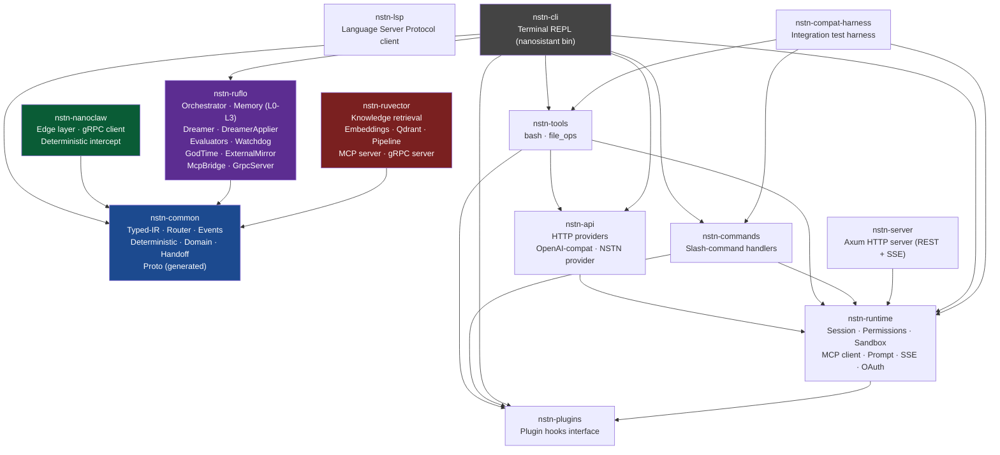

# Nanosistant Architecture Overview

## System Overview

Nanosistant is a sovereign, self-learning AI assistant built on a three-tier architecture that keeps all data and inference on user infrastructure. At the edge, **NanoClaw** (Rust) intercepts every message before an LLM is ever called, resolving closed-form queries deterministically and routing the rest through a seven-tier confidence ladder. Ambiguous messages pass to **RuFlo** (the orchestrator brain), which runs domain-specialized agents backed by a four-tier memory system (L0–L3) and an offline dreaming loop that distills episodic traces into durable lesson cards. A **RuVector** service provides semantic knowledge retrieval over Qdrant. Throughout the stack, a strict Typed-IR discipline ensures that LLMs only ever *propose* — deterministic Rust code validates and *executes*.

---

## 1. Three-Tier Architecture



---

## 2. Routing Pipeline

Every incoming message is passed through a deterministic pipeline before any LLM token is consumed. Each tier has a confidence threshold; the message falls through only when no tier is confident enough.



See [routing.md](routing.md) for a full deep-dive.

---

## 3. Memory Tier Diagram

Nanosistant's memory system has four tiers with distinct durability and write-access rules.



See [memory.md](memory.md) for full tier definitions.

---

## 4. Typed-IR Discipline

LLMs produce typed JSON proposals; Rust validates and executes them. No LLM call directly invokes a tool, writes a file, or changes routing weights.

```mermaid
sequenceDiagram
    participant User
    participant Orchestrator as Orchestrator (Rust)
    participant LLM as LLM (Anthropic/Azure/Ollama)
    participant Validator as Typed-IR Validator (Rust)
    participant Tools as Tools / State
    participant L1 as L1 EpisodicStore

    User->>Orchestrator: message
    Orchestrator->>LLM: prompt + context
    LLM-->>Orchestrator: typed JSON<br/>(RoutingProposal / ExecutionPlanIR /<br/>ToolRanking / AlignmentCheck)
    Orchestrator->>Validator: validate_routing_proposal()<br/>validate_execution_plan()<br/>validate_alignment_check()
    alt validation fails
        Validator-->>Orchestrator: Vec&lt;String&gt; errors
        Orchestrator->>LLM: re-prompt with error detail
    else validation passes
        Validator-->>Orchestrator: Ok(())
        Orchestrator->>Tools: execute typed plan
        Tools-->>Orchestrator: result
        Orchestrator->>L1: append L1Event (append-only)
        Orchestrator-->>User: response
    end
```

See [typed-ir.md](typed-ir.md) for all schema definitions and validation rules.

---

## 5. Dreaming Loop

Offline dreaming converts raw L1 traces into structured L2 lessons. Jona (the human principal) is the mandatory gate for any L3 policy changes.



---

## 6. Crate Dependency Graph

The project is a Cargo workspace with 13 crates. Arrows indicate `depends on`.



---

## Cross-Reference

| Document | Topic |
|---|---|
| [routing.md](routing.md) | Confidence ladder tiers, TOML config, adding a domain |
| [memory.md](memory.md) | L0–L3 schemas, dreaming, data flow |
| [typed-ir.md](typed-ir.md) | All IR types, validation functions, self-learning loop |
| [deployment.md](deployment.md) | Build, Docker, env vars, model providers, CI/CD |
| [security.md](security.md) | Sovereignty, permission tiers, sandbox, MCP isolation |
