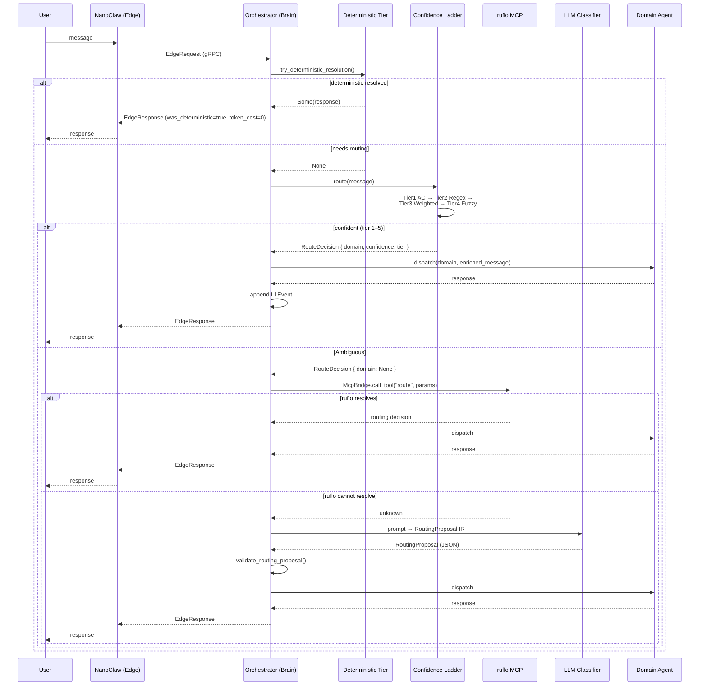

# Routing Pipeline Deep Dive

> Related: [overview.md](overview.md) · [memory.md](memory.md) · [typed-ir.md](typed-ir.md)

The routing pipeline is the most performance-critical path in Nanosistant. Its goal is to answer as many messages as possible without an LLM call, and when an LLM *is* needed, to route to the right domain agent first-try.

---

## 1. Confidence Ladder

The `ConfidenceLadderRouter` (`crates/common/src/router.rs`) runs every incoming message through up to five deterministic tiers before falling back to LLM-based resolution. Each tier has a confidence threshold; the message falls through only when the best score is below that tier's threshold.

### Tier 0 — Deterministic Functions

**Module:** `crates/common/src/deterministic.rs`  
**Entry point:** `try_deterministic_resolution(message: &str) -> Option<String>`  
**Complexity:** O(1) — pure Rust, zero LLM tokens

Before the router is invoked, the orchestrator calls `try_deterministic_resolution()`. If it returns `Some(response)`, the response is returned immediately. No router tier is consulted.

The function recognizes closed-form queries that have exact, computable answers:

| Category | Examples |
|---|---|
| Time / date | `"what time is it"`, `"what's the time?"` |
| BPM calculations | `"140 bpm bar duration"` → `1.714s` |
| Scale lookups | `"C major scale"` → `C D E F G A B` |
| Chord-in-key | `"Am in C major"` → `vi` |
| Frequency bands | `"2500hz band"` → `Upper Mids` |
| Percentage change | `"percentage change from 100 to 150"` → `+50.00%` |
| Word count | `"word count: some text here"` → `3 words` |

The full library of 30+ pure functions covers music theory (scales, chords, transposition, frequency-to-band, BPM, syllable counting, loudness checks), finance (percentage change, CAGR, position sizing), and utilities (word count, reading time, JSON/URL validation, ISRC validation, release timeline generation).

---

### Tier 1 — Aho-Corasick Automaton

**Struct:** `ConfidenceLadderRouter` (field `ac_automaton: AhoCorasick`)  
**Pattern type:** `RoutePattern { pattern, domain, weight, tags }`  
**Complexity:** O(n + z) — linear in text length, independent of pattern count  
**Default threshold:** `tier1_ac = 0.95`

The AC automaton is built once at startup from all literal patterns for all domains. At query time it performs a single left-to-right pass, collecting all matches. Per-domain scores are normalized against the sum of all pattern weights in that domain, so a single unambiguous match on a high-weight pattern can hit the threshold without requiring every keyword to appear.

Multi-word phrases (`"vocal chain"`, `"distortion lattice"`, `"false prophet"`) carry weight `0.95–0.99` — a single match is sufficient.

---

### Tier 2 — Regex Bank

**Field:** `regex_patterns: Vec<RegexPattern>`  
**Pattern type:** `RegexPattern { regex: Regex, domain, weight }`  
**Complexity:** O(m × n) — `m` patterns, `n` text length  
**Default threshold:** `tier2_regex = 0.80`

Compiled at startup. Each pattern matches a morphological family (e.g. `\b(compil\w+|refactor\w*)\b` catches `compilation`, `compiling`, `refactored`). The score for a domain is the *maximum* weight of all matching patterns (not the sum), preventing false confidence from many weak hits.

---

### Tier 3 — Weighted Keywords

**Field:** `weighted_keywords: HashMap<String, HashMap<String, f64>>`  
**Pattern type:** `WeightedKeyword { keyword, domain, weight }`  
**Complexity:** O(t × d) — `t` tokens in message, `d` domains  
**Default threshold:** `tier3_weighted = 0.65`

Unlike AC (exact multi-char match) or Regex (pattern match), weighted keywords work on individual tokens. The raw score for each domain is the sum of weights of matching tokens, normalized by the domain's total keyword weight (`weighted_mass`). This prevents sparse domains from being penalized when they have fewer keywords.

Weights can be updated at runtime via `update_weighted_keywords()`, making this the only tier that supports hot-reload from config or a database.

---

### Tier 4 — Fuzzy Levenshtein

**Field:** `fuzzy_anchors: Vec<FuzzyAnchor>`  
**Pattern type:** `FuzzyAnchor { term, domain, weight }`  
**Complexity:** O(t × a × L) — tokens × anchors × term length  
**Default threshold:** `tier4_fuzzy = 0.50`  
**Internal threshold:** `fuzzy_threshold = 82` (0–100 scale)

Uses `strsim::normalized_levenshtein` for typo recovery. Each token in the message is compared to each anchor term; if the similarity exceeds `fuzzy_threshold / 100.0`, the weighted score is recorded. Multi-word anchors are also matched against the full message text.

Only high-value terms with length ≥ 4 are registered as fuzzy anchors (via `router_from_trigger_configs()`), keeping the anchor set small and fast.

---

### Tier 5 — Combined Score

When no individual tier is confident enough, the router combines all four tier scores with fixed weights:

```
combined[domain] = 0.40 × t1[domain]
                 + 0.30 × t2[domain]
                 + 0.20 × t3[domain]
                 + 0.10 × t4[domain]
```

If the combined score exceeds `tier4_fuzzy`, it resolves at `resolved_at_tier = 5`. Otherwise the result is `Ambiguous` (domain = `None`).

---

### Tier 6 — ruflo MCP Bridge

**Module:** `crates/ruflo/src/mcp_bridge.rs`  
**Protocol:** JSON-RPC 2.0 over stdio  
**Process:** ruflo TypeScript runtime (spawned as a child process)

When the confidence ladder returns `Ambiguous`, the orchestrator calls the `McpBridge`. The bridge sends a `tools/call` JSON-RPC request to ruflo's MCP server, which applies Q-learning routing, Mixture-of-Experts selection, and semantic similarity. The result is a routing decision that is returned to Rust — ruflo never receives the user's traffic or executes anything directly.

The bridge spawns ruflo from `vendor/ruflo/` as a child process with `stdin/stdout` pipes. Discovery of available tools runs automatically on `start()` via `tools/list`.

---

### Tier 7 — LLM Classifier

When ruflo cannot resolve, the orchestrator falls back to a direct LLM call that must return a `RoutingProposal` (typed IR). This is validated by `validate_routing_proposal()` before acting on it. The `fallback` field must be one of `"ask_user"`, `"next_tier"`, or `"abort"`.

---

## 2. Configuration — Domain Definitions in TOML

Domains are defined in `config/agents/*.toml`. Each file maps to one domain agent. The shared schema for trigger configuration:

```toml
# config/agents/music.toml (example shape)
[triggers]
keywords = ["verse", "hook", "beat", "bpm", "808", "vocal chain", "eq"]
priority = 80
```

The `TriggerConfig` struct (`crates/common/src/domain.rs`):

```rust
pub struct TriggerConfig {
    pub keywords: Vec<String>,
    pub priority: u32,   // 0–100; higher = more weight
}
```

The helper `router_from_trigger_configs()` converts these configs into a full `ConfidenceLadderRouter`, automatically registering each keyword as:
- An AC pattern (Tier 1) with weight scaled by priority
- A weighted keyword (Tier 3) with the same weight
- A fuzzy anchor (Tier 4) if `keyword.len() >= 4`
- A regex pattern (Tier 2) for alphabetic keywords ≥ 4 chars (`stem\w*`)

The config-derived router uses relaxed thresholds since each domain has fewer patterns than a purpose-built system:

```
tier1_ac     = 0.30   # one AC hit = strong signal
tier2_regex  = 0.75
tier3_weighted = 0.25
tier4_fuzzy  = 0.45
```

---

## 3. How to Add a New Domain

### Step 1 — Create the agent config

```toml
# config/agents/mydomin.toml
[agent]
name = "mydomain"
model = "claude-sonnet-4-20250514"

[triggers]
keywords = ["uniquekw1", "uniquekw2", "specific phrase"]
priority = 70
```

### Step 2 — Create the system prompt

```markdown
<!-- config/prompts/mydomain.md -->
You are the MyDomain specialist for Nanosistant...
```

### Step 3 — Register the domain in the orchestrator

In `crates/ruflo/src/orchestrator.rs`, add the domain to the agent registry so `AgentFactory` can instantiate it:

```rust
agent_factory.register("mydomain", AgentConfig {
    name: "mydomain",
    prompt_path: "config/prompts/mydomain.md",
    ...
});
```

### Step 4 — Add high-precision Tier 1 patterns (optional)

For phrases unique to your domain, add `RoutePattern` entries directly to the `RouterBuilder`:

```rust
builder.add_pattern(RoutePattern {
    pattern: "my very specific phrase".into(),
    domain: "mydomain".into(),
    weight: 0.99,
    tags: vec!["high_precision".into()],
});
```

### Step 5 — Test routing

```bash
cargo test -p nstn-common -- router
```

Run the existing router test suite; add cases for your keywords to `crates/common/src/router.rs`.

---

## 4. Full Pipeline Sequence Diagram



---

## RouterThresholds Reference

| Threshold | Default | Description |
|---|---|---|
| `tier1_ac` | `0.95` | Normalized AC score to route at Tier 1 |
| `tier2_regex` | `0.80` | Max regex weight to route at Tier 2 |
| `tier3_weighted` | `0.65` | Normalized weighted-keyword score for Tier 3 |
| `tier4_fuzzy` | `0.50` | Weighted fuzzy similarity score for Tier 4 |
| `fuzzy_threshold` | `82` | Internal Levenshtein cutoff (0–100 scale) |

Config-derived routers (`router_from_trigger_configs()`) use relaxed defaults: `0.30 / 0.75 / 0.25 / 0.45`.

Override at runtime with `router.set_thresholds(RouterThresholds { ... })`.
