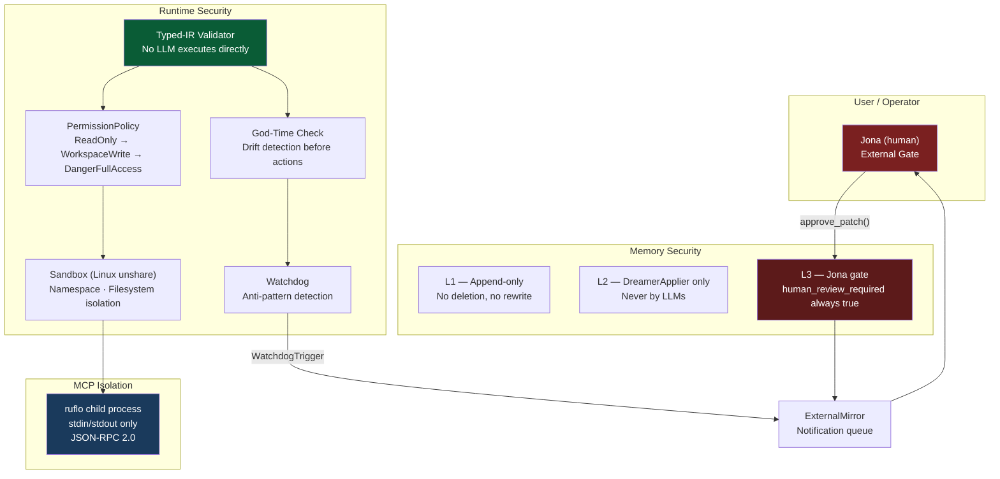

# Security Architecture

> Related: [overview.md](overview.md) · [typed-ir.md](typed-ir.md) · [memory.md](memory.md) · [deployment.md](deployment.md)

---

## 1. Sovereignty Model

Nanosistant is designed for **on-premises, user-controlled deployment**. The sovereignty model has three properties:

1. **Data locality** — all episodic traces (L1), lesson cards (L2), and identity policy (L3) are stored on user infrastructure. No data is sent to third parties unless the user explicitly configures an external model provider.

2. **Inference control** — the system can run entirely against a local model via Ollama. The model provider is a pluggable configuration; no Anthropic or Azure call is made unless the corresponding API key is set.

3. **No autonomous policy changes** — the system's identity and policy (L3) can only be modified through a human-gated patch queue. The Dreamer may *propose* changes; Jona must *approve* them before application. This is enforced architecturally: `L3PatchProposal::new()` hardcodes `human_review_required = true` and there is no code path that calls `approve_patch()` without external input.

---

## 2. Permission Tiers

**Module:** `crates/runtime/src/permissions.rs`  
**Struct:** `PermissionPolicy` with `active_mode: PermissionMode`

```rust
pub enum PermissionMode {
    ReadOnly,          // tools may only read; writes are denied
    WorkspaceWrite,    // writes within the workspace are allowed
    DangerFullAccess,  // unrestricted — bash, system tools
    Prompt,            // ask before each escalation
    Allow,             // unconditional allow (internal use)
}
```

### Tier Definitions

| Mode | Description | Escalation |
|---|---|---|
| `ReadOnly` | Only `read_file`, `list_files` class tools | Denied without a prompter |
| `WorkspaceWrite` | Writes within the workspace directory | Prompts before `DangerFullAccess` tools |
| `DangerFullAccess` | `bash`, arbitrary shell execution, system access | No further escalation needed |
| `Prompt` | Every escalation triggers a `PermissionPrompter` decision | Per-request |
| `Allow` | Internal override — bypasses all checks | N/A |

### Authorization Flow

`PermissionPolicy::authorize(tool_name, input, prompter)`:

1. If `active_mode >= required_mode` → `Allow` (no prompt needed)
2. If `active_mode == Prompt` or escalating `WorkspaceWrite → DangerFullAccess` → delegate to `PermissionPrompter::decide()`
3. Otherwise → `Deny { reason }` with the specific modes in the message

Tool requirements are registered at startup:

```rust
PermissionPolicy::new(PermissionMode::WorkspaceWrite)
    .with_tool_requirement("read_file",  PermissionMode::ReadOnly)
    .with_tool_requirement("write_file", PermissionMode::WorkspaceWrite)
    .with_tool_requirement("bash",       PermissionMode::DangerFullAccess)
```

Unknown tools default to `DangerFullAccess` required — the safe default rejects them unless the active mode is `DangerFullAccess` or `Allow`.

---

## 3. Sandbox — Linux Namespace Isolation

**Module:** `crates/runtime/src/sandbox.rs`

The sandbox layer provides OS-level isolation for tool execution. It uses Linux `unshare` namespaces and supports three filesystem modes.

### Filesystem Isolation Modes

```rust
pub enum FilesystemIsolationMode {
    Off,            // no filesystem restrictions
    WorkspaceOnly,  // sandbox home/tmp point inside workspace
    AllowList,      // only allowed_mounts are accessible
}
```

### Sandbox Status Resolution

`resolve_sandbox_status(config, cwd)` inspects the runtime environment and returns a `SandboxStatus` describing what isolation is actually active:

| Field | Meaning |
|---|---|
| `namespace_supported` | `unshare` binary is present on `PATH` on Linux |
| `namespace_active` | Namespace isolation requested AND `unshare` available |
| `network_active` | Network isolation requested AND `unshare` available |
| `filesystem_active` | Filesystem mode is not `Off` |
| `in_container` | Running inside Docker/Podman/containerd (auto-detected) |
| `fallback_reason` | Why requested isolation could not be applied |

### Linux Sandbox Command

When namespace isolation is active, tool commands are wrapped with `unshare`:

```bash
unshare --user --map-root-user --mount --ipc --pid --uts --fork [--net] sh -lc <command>
```

With environment overrides:
- `HOME` → `{cwd}/.sandbox-home`
- `TMPDIR` → `{cwd}/.sandbox-tmp`
- `NSTN_SANDBOX_FILESYSTEM_MODE` → active mode string
- `NSTN_SANDBOX_ALLOWED_MOUNTS` → colon-separated mount list

### Container Detection

Auto-detection checks multiple signals to determine if the process is running inside a container:

| Signal | Checked path/variable |
|---|---|
| Docker sentinel | `/.dockerenv` exists |
| Container sentinel | `/run/.containerenv` exists |
| Environment variables | `CONTAINER`, `DOCKER`, `PODMAN`, `KUBERNETES_SERVICE_HOST` |
| cgroup markers | `/proc/1/cgroup` contains `docker`, `containerd`, `kubepods`, `podman`, `libpod` |

When `in_container == true`, namespace restrictions may be unavailable (containers typically lack permission to create new user namespaces). The sandbox records the fallback reason and continues with filesystem-level isolation only.

---

## 4. External Mirror — Jona as Human Gate

**Module:** `crates/ruflo/src/external_mirror.rs`  
**Struct:** `ExternalMirror` — persisted notification queue at `{data_dir}/mirror.json`

All events that require human attention are pushed to the `ExternalMirror` as `MirrorNotification` entries. Jona reviews and acknowledges them.

### Notification Types

```rust
pub enum NotificationType {
    WatchdogTrigger,      // agent anti-pattern detected
    DreamingReport,       // offline batch analysis complete
    L3PatchProposal,      // proposed policy change awaiting approval
    SafetyIncident,       // unsafe action blocked
    SystemHealth,         // degraded/critical health signal from Dreamer
}
```

### Notification Schema

```rust
pub struct MirrorNotification {
    pub id: String,                        // UUID v4
    pub timestamp: DateTime<Utc>,
    pub notification_type: NotificationType,
    pub summary: String,
    pub details: serde_json::Value,        // structured context
    pub requires_action: bool,             // true for L3 patches, watchdog triggers
    pub acknowledged: bool,
}
```

### L3 Patch Gate

The only path to modifying L3 policy:

```
DreamingReport.l3_patch_proposals
  → DreamerApplier.apply()
  → IdentityPolicy.queue_patch(proposal)    # status = Pending
  → ExternalMirror.notify(L3PatchProposal)  # requires_action = true
  → Jona reviews
  → IdentityPolicy.approve_patch(id)        # status = Approved
  → IdentityPolicy.apply_approved()         # status = Applied
  OR
  → IdentityPolicy.reject_patch(id)         # status = Rejected
```

`approve_patch()` validates that the patch is in `Pending` status before changing it — an already-rejected patch cannot be re-approved without a new proposal cycle.

### Watchdog → ExternalMirror Flow

When `Watchdog` detects a pattern (`StuckLoop`, `TokenWaste`, `HandoffFailure`, `BudgetBlindness`, `SpecRepetition`), it fires a `WatchdogTriggered` event. The orchestrator surfaces this to `ExternalMirror` with `requires_action = true` and includes the session context in `details`.

---

## 5. MCP Bridge Isolation — ruflo as Sandboxed Child

**Module:** `crates/ruflo/src/mcp_bridge.rs`  
**Struct:** `McpBridge`

The ruflo MCP server runs as a **child process** of the Rust orchestrator. It is not in the hot path of user traffic; it is consulted only when the confidence ladder returns `Ambiguous`.

### Isolation Properties

| Property | Detail |
|---|---|
| **Process boundary** | ruflo runs as a separate OS process (`Command::new("npx") ...`) |
| **stdin/stdout only** | Communication is strictly newline-delimited JSON-RPC 2.0; no shared memory, no sockets |
| **No direct user access** | The user's message is never sent to ruflo directly; only routing metadata is passed |
| **Graceful shutdown** | `McpBridge::stop()` calls `child.kill()` + `child.wait()` on drop |
| **Offline fallback** | `McpBridge::offline()` creates a stub that returns `BridgeError::NotRunning` — used when Node.js/ruflo is unavailable |

### Protocol

```
Rust Orchestrator (parent)
  │
  ├─ stdin  →  { "jsonrpc": "2.0", "id": N, "method": "tools/call", "params": {...} }
  │
  └─ stdout ←  { "jsonrpc": "2.0", "id": N, "result": {...} }
                           ruflo MCP server (child)
```

The MCP initialization handshake (`initialize` + `notifications/initialized`) runs on `start()` before any routing calls. Tool discovery (`tools/list`) runs automatically if `auto_discover == true`.

### Security Invariants

1. ruflo may only *return* a routing decision — it cannot write to L1, L2, or L3 directly.
2. All routing decisions returned by ruflo are treated as `Ambiguous` candidates and still pass through the Rust orchestrator's dispatch logic.
3. The bridge child process inherits no sensitive environment variables from the parent beyond what is needed to run the TypeScript entry point.
4. If the child process terminates unexpectedly, subsequent `call_tool()` calls return `BridgeError::NotRunning` — the system degrades gracefully to LLM-only routing (Tier 7).

---

## Security Properties Summary


