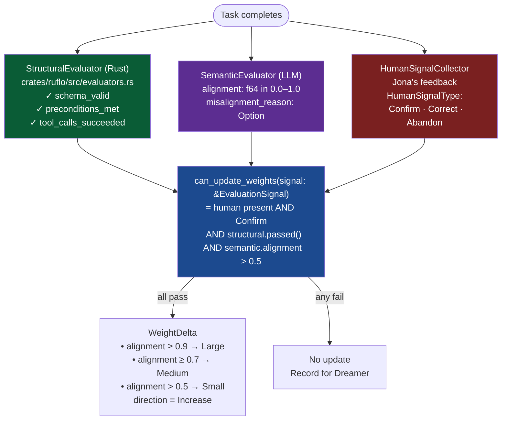

# Typed-IR Discipline

> Related: [overview.md](overview.md) · [memory.md](memory.md) · [routing.md](routing.md)

**Module:** `crates/common/src/typed_ir.rs`

---

## 1. The Principle

> *LLMs propose. Rust executes.*

Every LLM output that leads to a state change — routing a message, running a plan, adjusting weights, or modifying policy — must pass through a **Typed Intermediate Representation** (Typed-IR). No LLM call directly invokes a tool, writes a file, changes routing weights, or modifies the memory tiers.

The flow is invariant:

```
LLM output (JSON string)
  → serde_json::from_str::<TypedIR>()
  → validate_*(ir)   [pure Rust, no LLM]
  → if Ok: Rust executes
  → if Err: re-prompt LLM with validation errors
```

This property is enforced architecturally: all mutation paths in `MemorySystem`, `IdentityPolicy`, and the tool-execution layer require a validated typed struct as input — there is no API accepting raw LLM prose.

---

## 2. All Typed Schemas

### RoutingProposal

The LLM proposes how to route an ambiguous message. Used by the LLM classifier (Tier 7).

```rust
pub struct RoutingProposal {
    pub intent_class: String,      // human-readable intent label
    pub confidence: f64,           // must be in [0.0, 1.0]
    pub tool_chain: Vec<String>,   // must be non-empty
    pub preconditions: Vec<String>,
    pub fallback: String,          // must be "ask_user" | "next_tier" | "abort"
}
```

---

### ExecutionPlanIR

The LLM proposes a multi-step execution plan. No runtime state (`StepStatus`) is attached at proposal time — status is managed by Rust.

```rust
pub struct ExecutionPlanIR {
    pub goal: String,
    pub steps: Vec<PlanStepIR>,
}

pub struct PlanStepIR {
    pub id: String,                       // non-empty
    pub role: String,                     // non-empty — e.g. "executor", "verifier"
    pub description: String,              // non-empty
    pub inputs: Vec<String>,
    pub expected_outputs: Vec<String>,
    pub termination_condition: String,
    pub rollback: Option<String>,
}
```

The runtime version `ExecutionPlan` / `PlanStep` (in `crates/ruflo/src/memory.rs`) adds `status: StepStatus` and is managed exclusively by Rust.

---

### ToolRanking

The LLM ranks tools by relevance instead of calling them directly. Rust then selects from the ranking.

```rust
pub struct ToolRanking {
    pub ranked_tools: Vec<RankedTool>,  // must be non-empty
    pub query: String,
}

pub struct RankedTool {
    pub tool: String,
    pub score: f64,      // must be in [0.0, 1.0]
    pub rationale: String,
}
```

---

### EvaluationSignal

Three-signal evaluation combining structural (Rust), semantic (LLM), and human (Jona) assessments. Required by the weight-update gate `can_update_weights()`.

```rust
pub struct EvaluationSignal {
    pub structural: StructuralEval,
    pub semantic: SemanticEval,
    pub human: Option<HumanSignal>,
}

pub struct StructuralEval {
    pub schema_valid: bool,
    pub preconditions_met: bool,
    pub tool_calls_succeeded: bool,
    pub details: String,
}

pub struct SemanticEval {
    pub alignment: f64,              // 0.0–1.0
    pub misalignment_reason: Option<String>,
}

pub struct HumanSignal {
    pub signal_type: HumanSignalType,
    pub delta: Option<String>,
}

pub enum HumanSignalType { Confirm, Correct, Abandon }
```

---

### AlignmentCheck

A pre-flight check before any non-trivial action. Produced by the LLM; validated before the action proceeds.

```rust
pub struct AlignmentCheck {
    pub action: String,                   // non-empty
    pub check_results: AlignmentResults,
    pub decision: AlignmentDecision,
}

pub struct AlignmentResults {
    pub external_gate_required: bool,
    pub reversible: bool,
    pub touches_l3: bool,
    pub god_time_status: GodTimeStatus,   // Confirmed | DriftDetected | Unknown
}

pub enum AlignmentDecision {
    Proceed,
    Block { reason: String },
    QueueForReview { reason: String },
}
```

---

### WeightDelta

A proposed routing weight adjustment. Never applied by the LLM; applied only by Rust after `can_update_weights()` returns `true`.

```rust
pub struct WeightDelta {
    pub task_type: String,
    pub route_stage: String,            // e.g. "tier1", "tier3"
    pub direction: WeightDirection,     // Increase | Decrease
    pub magnitude: WeightMagnitude,     // Small | Medium | Large
    pub reason: String,
    pub supporting_episodes: Vec<String>,
}
```

---

## 3. Validation Functions

All validation functions return `Result<(), Vec<String>>` — multiple errors are accumulated rather than short-circuiting, so the full set of violations is available for LLM re-prompting.

### `validate_routing_proposal(p: &RoutingProposal)`

| Check | Rule |
|---|---|
| `confidence` | Must be in `[0.0, 1.0]` |
| `tool_chain` | Must be non-empty |
| `fallback` | Must be one of `"ask_user"`, `"next_tier"`, `"abort"` |

### `validate_execution_plan(p: &ExecutionPlanIR)`

| Check | Rule |
|---|---|
| `steps` | Must be non-empty |
| `step[i].id` | Must be non-empty |
| `step[i].role` | Must be non-empty |
| `step[i].description` | Must be non-empty |

### `validate_tool_ranking(p: &ToolRanking)`

| Check | Rule |
|---|---|
| `ranked_tools` | Must be non-empty |
| `ranked_tools[i].score` | Must be in `[0.0, 1.0]` |

### `validate_alignment_check(p: &AlignmentCheck)`

| Check | Rule |
|---|---|
| `action` | Must be non-empty |
| `god_time_status == DriftDetected` | `decision` must not be `Proceed` |
| `external_gate_required == true` | `decision` must not be `Proceed` |

### `validate_dreaming_report(report: &DreamingReport)` (in `crates/ruflo/src/dreamer.rs`)

| Check | Rule |
|---|---|
| `lesson_cards` | Maximum 5 per report |
| `system_mode == ReadOnly` | No `l3_patch_proposals` allowed |
| `system_mode == ReadOnly` | No `orchestrator_dispatch` allowed |
| Each lesson card | Must have ≥ 1 `supporting_episodes` |
| `health_signal == Healthy` | Failure rate must be ≤ 15% and no Galileo patterns |

---

## 4. Self-Learning Loop — Three Evaluators

The self-learning loop uses three heterogeneous evaluators to decide whether routing weights should be updated. All three must agree before any update is applied.



`evaluate_for_learning()` (`crates/ruflo/src/evaluators.rs`) is the combined entry point. It returns `Option<Vec<WeightDelta>>` — `None` when any gate fails.

The magnitude mapping from `SemanticEval.alignment`:

| Alignment | Magnitude |
|---|---|
| `> 0.5` and `< 0.7` | `Small` |
| `≥ 0.7` and `< 0.9` | `Medium` |
| `≥ 0.9` | `Large` |

---

## 5. God-Time Check — Drift Detection

Before any non-trivial action, the system checks whether it is acting from genuine understanding (God-Time) or from pattern-fill drift (Drift-Time).

**Module:** `crates/ruflo/src/god_time.rs`  
**Entry point:** `check_god_time(context: &WorkingContext, recent_events: &[L1Event]) -> GodTimeCheckResult`

### Drift Signals

| Signal | Condition |
|---|---|
| **No goal** | `context.current_goal.trim().is_empty()` |
| **Loop** | Last 3 events all share the same `intent` |
| **Failure without adaptation** | Last 3 events all have failure-class `outcome` AND `plan_stated` unchanged |
| **Confusion marker** | Any `context.notes` entry contains `"confused"` or `"unsure"` |

### Result

```rust
pub struct GodTimeCheckResult {
    pub status: GodTimeStatus,     // Confirmed | DriftDetected | Unknown
    pub reason: String,
    pub action_allowed: bool,
}
```

When `status == DriftDetected` the `AlignmentCheck` validation rule forbids `AlignmentDecision::Proceed`. The action is blocked and surfaced to Jona via `ExternalMirror`.

`GodTimeStatus` maps directly to the `god_time_status` field of `AlignmentResults`, creating a closed loop: the LLM's own `AlignmentCheck` proposal must be consistent with the Rust-computed drift signal.
